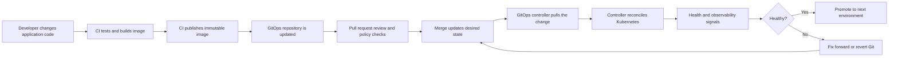

# GitOps: Fundamentals

Welcome to the **GitOps: Fundamentals** course.

This reusable, vendor-neutral training explains GitOps principles, repository design, reconciliation, environment promotion, security, and operational practices. The practical path uses Kubernetes and Argo CD, with additional examples for Helm, Kustomize, Jenkins, GitHub Actions, ApplicationSet, and Flux.

> This is an independent educational resource. It is not an official CNCF, OpenGitOps, Argo, Flux, Helm, Kustomize, GitHub, or Jenkins course and is not endorsed by those projects or organizations.

---

## Course Objectives

By the end of this course participants will be able to:

- Explain GitOps and the four OpenGitOps principles
- Distinguish GitOps from Git-based CI/CD and Infrastructure as Code
- Describe desired state, actual state, drift, reconciliation, and convergence
- Design application and environment repositories
- Explain push-based and pull-based delivery models
- Install Argo CD in a disposable Kubernetes cluster
- Create Argo CD `Application` and `AppProject` resources declaratively
- Deploy plain Kubernetes YAML, Kustomize overlays, and Helm charts
- Configure manual and automated synchronization
- Use pruning, self-healing, sync waves, hooks, and sync windows safely
- Detect, investigate, and remediate configuration drift
- Design promotion workflows for development, staging, and production
- Integrate CI systems without giving them unnecessary cluster credentials
- Apply GitOps security controls for repositories, clusters, secrets, and identities
- Generate multiple applications with ApplicationSet
- Explain multi-cluster and fleet-management patterns
- Compare Argo CD and Flux at a practical architectural level
- Observe and troubleshoot GitOps controllers and application health
- Design a production-ready GitOps operating model

---

## Course Structure

| Session | Topic | Practical focus |
|---|---|---|
| 0 | Course introduction and lab setup | Prepare Git, Kubernetes, `kubectl`, Helm, and a disposable cluster |
| 1 | GitOps foundations | Desired state, reconciliation, drift, and OpenGitOps principles |
| 2 | Repository and delivery design | Application repositories, environment repositories, and promotion |
| 3 | Argo CD fundamentals | Install Argo CD and deploy the first application |
| 4 | Synchronization and operations | Automated sync, pruning, self-healing, health, rollback, and drift |
| 5 | Helm and Kustomize | Manage reusable bases, overlays, charts, and environment values |
| 6 | Security and governance | AppProjects, RBAC, secrets, approvals, policies, and sync windows |
| 7 | Scale and automation | ApplicationSet, multi-cluster patterns, and CI image updates |
| 8 | Flux, observability, troubleshooting, and final design | Compare tools, operate controllers, and complete the final project |

---

## Repository Structure

```text
gitops-fundamentals/
├── README.md
├── MANIFEST.md
├── LICENSE.md
├── Makefile
├── .gitignore
├── slides/
│   ├── 00_course_introduction.md
│   ├── 01_gitops_foundations.md
│   ├── 02_repository_and_delivery_design.md
│   ├── 03_argocd_fundamentals.md
│   ├── 04_synchronization_and_operations.md
│   ├── 05_helm_and_kustomize.md
│   ├── 06_security_and_governance.md
│   ├── 07_scale_applicationset_and_ci.md
│   └── 08_flux_observability_and_final_design.md
├── docs/
│   ├── lab_setup.md
│   ├── gitops_principles.md
│   ├── architecture_and_reconciliation.md
│   ├── repository_strategies.md
│   ├── argocd_cheat_sheet.md
│   ├── helm_and_kustomize.md
│   ├── security_and_secrets.md
│   ├── ci_gitops_integration.md
│   ├── multi_environment_and_promotion.md
│   ├── applicationset_and_multicluster.md
│   ├── flux_comparison.md
│   ├── observability_and_operations.md
│   ├── troubleshooting.md
│   ├── glossary.md
│   ├── useful_links.md
│   ├── instructor_guide.md
│   └── repository_integration.md
├── labs/
│   ├── README.md
│   ├── 01_cluster_and_argocd_setup.md
│   ├── 02_first_application.md
│   ├── 03_automated_sync_and_drift.md
│   ├── 04_kustomize_environments.md
│   ├── 05_helm_application.md
│   ├── 06_projects_rbac_and_sync_windows.md
│   ├── 07_applicationset.md
│   ├── 08_ci_updates_gitops.md
│   ├── 09_flux_comparison.md
│   └── 10_final_project.md
├── examples/
│   ├── app/
│   │   ├── base/
│   │   └── overlays/
│   │       ├── dev/
│   │       ├── staging/
│   │       └── prod/
│   ├── argocd/
│   │   ├── applications/
│   │   ├── projects/
│   │   └── applicationsets/
│   ├── helm/demo-app/
│   ├── ci/
│   └── flux/
├── scripts/
│   ├── create_kind_cluster.sh
│   ├── install_argocd.sh
│   ├── validate_environment.sh
│   ├── validate_content.py
│   └── uninstall_lab.sh
└── quizzes/
    ├── 01_foundations.md
    ├── 02_argocd_and_configuration.md
    ├── 03_security_scale_and_operations.md
    └── 04_final_assessment.md
```

---

## Prerequisites

Recommended knowledge:

- Basic Git usage: clone, branch, commit, push, pull request, and merge
- Basic Linux command-line usage
- Basic Kubernetes knowledge: Pods, Deployments, Services, Namespaces, ConfigMaps, Secrets, and RBAC
- Familiarity with YAML
- General understanding of CI/CD
- A text editor or IDE

The course does not require a public cloud account. The core labs are designed for a local disposable Kubernetes cluster.

---

## Recommended Lab Environment

- Linux, macOS, or Windows with WSL
- Git
- Docker Engine or another container runtime supported by the selected local cluster tool
- `kubectl`
- `kind` or an existing disposable Kubernetes cluster
- Helm 3
- Optional: Argo CD CLI
- Optional: Flux CLI for the comparison lab
- Optional: Kustomize CLI; `kubectl kustomize` is sufficient for the included examples

Use a dedicated practice Git repository that is safe to make public or keep private. Never store real credentials in the course repository.

See [docs/lab_setup.md](docs/lab_setup.md) for detailed setup guidance.

---

## Getting Started

Clone the repository and enter the module:

```bash
git clone https://github.com/VLD62/technical-trainings.git
cd technical-trainings/gitops-fundamentals
```

List the available materials:

```bash
make list
```

Check the local environment:

```bash
make check-environment
```

Validate Markdown links, example references, YAML syntax, and shell scripts:

```bash
make content-check
```

Create a disposable `kind` cluster:

```bash
make cluster-create
```

Install Argo CD:

```bash
make argocd-install
```

Render the Kustomize environments:

```bash
make render
```

Lint the included Helm chart:

```bash
make helm-lint
```

Remove the disposable lab resources:

```bash
make clean-lab
```

---

## Recommended Learning Approach

For each session:

1. Review the corresponding slide deck
2. Read the related reference documents
3. Inspect the example manifests before applying them
4. Predict the generated and live state
5. Make changes through Git rather than directly in the cluster
6. Observe Argo CD or Flux reconciliation
7. Inspect application health, sync status, events, and controller logs
8. Record why a change was made in the commit or pull request
9. Complete the associated quiz
10. Remove disposable lab resources after the exercise

The course can be delivered as:

- A compact two-day practical workshop
- Four half-day sessions
- A multi-week platform engineering onboarding module
- A self-study course with guided labs and a capstone project

---

## Core Workflow



---

## Safety Notes

- Use only disposable training clusters and repositories.
- Do not install the lab into production clusters.
- Do not commit passwords, tokens, kubeconfig files, private keys, or unencrypted secrets.
- Treat Git write access as production access when automated reconciliation is enabled.
- Protect default and production branches with reviews and status checks.
- Prefer immutable image digests or deliberately versioned tags.
- Review generated manifests before enabling automated synchronization.
- Enable pruning and self-healing only after understanding their impact.
- Scope Argo CD projects, repository access, cluster destinations, and Kubernetes RBAC.
- Avoid giving CI systems broad Kubernetes credentials.
- Separate build automation from deployment reconciliation.
- Back up Argo CD declarative configuration and understand disaster-recovery procedures.
- Use a documented break-glass process for urgent cluster changes.
- Reconcile emergency changes back into Git immediately.
- Verify third-party manifests and pin versions for production installation.
- Never use example secret values outside a disposable lab.

---

## License

Educational content, including presentations, documentation, exercises, and quizzes, is licensed under the Creative Commons Attribution-NonCommercial-ShareAlike 4.0 International License.

Source code, scripts, and executable examples are licensed separately under the MIT License.

Kubernetes, CNCF, OpenGitOps, Argo, Argo CD, Flux, Helm, Kustomize, GitHub, Jenkins, and related names are trademarks of their respective owners. Third-party documentation and project materials remain subject to their respective licenses.

## Author

Vladislav Iliev

[LinkedIn](https://www.linkedin.com/in/vladislav-iliev/)
