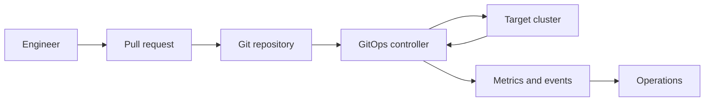

# Architecture and Reconciliation

## Generic Architecture

A GitOps system normally contains:

- A source of desired state
- Authentication to read that source
- A renderer or configuration-management tool
- A controller
- A target API
- A state comparison mechanism
- Health assessment
- Events, logs, metrics, and notifications
- Governance around changes



## Argo CD Components

### API Server

The API server exposes:

- Web UI
- CLI and API endpoints
- Authentication
- Authorization
- Application operations

### Repository Server

The repository server:

- Clones or fetches sources
- Invokes manifest-generation tools
- Produces desired Kubernetes manifests
- Caches generated data

Because it processes repository content, treat it as a high-value component. Custom plugins require careful isolation and review.

### Application Controller

The application controller:

- Watches Argo CD `Application` resources
- Compares desired and live state
- Determines sync status
- Executes synchronization
- Assesses resource health
- Records application history

### Redis

Redis is used for caching and coordination. Availability requirements depend on the selected installation mode.

### Dex

Dex can provide identity integration in supported configurations. Many organizations integrate Argo CD directly with an external OpenID Connect provider.

### ApplicationSet Controller

The ApplicationSet controller generates Argo CD `Application` resources from templates and generators.

## Reconciliation Sequence

1. The controller reads the `Application`.
2. Argo CD resolves the source revision.
3. The repository server generates manifests.
4. Argo CD queries the target cluster.
5. Desired and live resources are compared.
6. Sync status is calculated.
7. Health is assessed separately.
8. A manual or automated policy may trigger synchronization.
9. Resources are applied in an ordered operation.
10. The loop repeats.

## Sync Status Versus Health

These are related but different:

- **Synced:** Live configuration matches the generated desired manifests.
- **OutOfSync:** A relevant difference exists.
- **Healthy:** Workload health checks indicate the application is functioning as expected.
- **Progressing:** A rollout or transition is still in progress.
- **Degraded:** A health assessment indicates failure.
- **Missing:** A desired resource is absent.
- **Unknown:** Health cannot be determined.

An application can be synced but degraded. For example, the desired Deployment may specify an invalid image. The cluster can exactly match Git while the Pods fail.

## Automated Sync

Automated sync allows Argo CD to reconcile changes without a person pressing a sync button.

Common options:

```yaml
spec:
  syncPolicy:
    automated:
      enabled: true
      prune: true
      selfHeal: true
      allowEmpty: false
```

Use the options deliberately:

- `enabled`: permits automatic synchronization
- `prune`: removes resources no longer present in desired state
- `selfHeal`: corrects eligible live drift
- `allowEmpty`: allows a source to render no resources; dangerous if enabled unintentionally

## Pruning

Without pruning, removing a manifest from Git does not necessarily delete the live resource.

Pruning is powerful and potentially destructive. Reduce risk through:

- Review requirements
- Render validation
- Namespace and project scoping
- Protected resources
- Sync windows
- Backups
- Staged promotion
- Clear resource-ownership rules

## Self-Healing

Self-healing corrects direct live changes. It is useful for drift control, but it changes emergency operating procedures.

A safe break-glass process should include:

1. Declare the incident
2. Pause or constrain reconciliation only where necessary
3. Make the minimum emergency change
4. Record the change
5. Update Git
6. Restore normal reconciliation
7. Review why the emergency path was needed

## Polling and Webhooks

Controllers can periodically check repositories. Webhooks can reduce detection latency, but polling remains important for resilience.

A webhook is a hint that something changed. Reconciliation remains the source of truth.

## Idempotency

A reconciliation action should be safe to repeat. Declarative APIs and resource versioning help controllers converge without depending on a single successful run.

## Eventual Consistency

GitOps systems are eventually consistent. A merge does not mean every cluster changes at the same instant. Consider:

- Repository polling interval
- Webhook delivery
- Queueing
- Manifest generation
- API throttling
- Rollout time
- Health assessment
- Network partitions
- Cluster unavailability

Define realistic delivery service-level objectives rather than promising instantaneous convergence.
