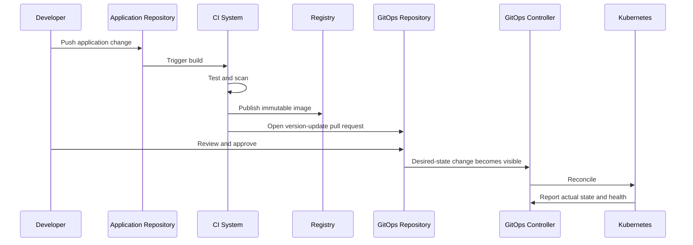

# CI and GitOps Integration

## Separation of Responsibilities

A clean operating model separates:

### Continuous Integration

- Compile or package
- Unit test
- Integration test
- Static analysis
- Dependency scanning
- Build container image
- Sign artifact
- Publish immutable artifact
- Produce metadata

### GitOps Delivery

- Update desired state
- Review environment change
- Merge approved configuration
- Pull and reconcile
- Assess sync and health
- Promote or revert

## Preferred Flow



## Why CI Should Not Usually Deploy Directly

Direct CI deployment often requires:

- Long-lived cluster credentials
- Network access to each cluster
- Imperative deployment scripts
- Separate audit history
- More difficult drift detection

GitOps lets CI stop after proposing a desired-state change.

Exceptions exist, but ownership must be explicit. Do not let CI and a GitOps controller compete over the same resources.

## Image Update Methods

### Manual Pull Request

A person updates:

```yaml
images:
  - name: nginx
    newTag: 1.27.5-alpine
```

Best for controlled production environments and learning.

### CI-Created Pull Request

CI:

1. Builds an image
2. Resolves the immutable digest
3. Changes the GitOps repository
4. Opens a pull request
5. Attaches test evidence

This is the main recommended course pattern.

### Automated Image Controller

A controller detects new image versions and updates Git or policy state.

Benefits:

- Low manual effort
- Fast patch adoption

Trade-offs:

- Version policies must be explicit
- Production promotion may need approval
- Automation identity can write desired state

## Jenkins Pattern

The included `Jenkinsfile` demonstrates:

- Build metadata
- Test stage placeholder
- Image publication boundary
- GitOps repository checkout
- Kustomize image update
- Commit and push or pull-request handoff

Real implementations should use:

- Dedicated credentials
- Secret masking
- Protected branches
- Pull requests instead of direct production pushes
- Retry and concurrency controls
- Signed artifacts
- Immutable digests

## GitHub Actions Pattern

The included workflow demonstrates:

- Manual or reusable invocation
- Input validation
- Repository checkout
- Kustomize update
- Validation
- Pull-request creation boundary

Do not use a broad personal access token when a repository-scoped application token or fine-grained identity is available.

## Commit Design

A useful GitOps commit states:

- What application changed
- Old and new version
- Target environment
- Build or release reference
- Reason for promotion

Example:

```text
promote(demo-app): staging 1.4.2 -> 1.4.3

Image: registry.example.com/demo-app@sha256:...
Build: app-ci/1842
Source: application commit 8c12d4a
```

## Pull-Request Checks

Recommended checks:

- YAML parse
- Helm lint
- Kustomize render
- Kubernetes schema validation
- Policy validation
- Secret detection
- Image allow-list
- Signature or provenance verification
- Diff summary
- Preview environment where justified
- Required reviewers for production paths

## Avoiding Commit Loops

Automation can trigger itself repeatedly.

Prevent loops with:

- Path filters
- Commit-message markers
- Separate identities
- Pull requests
- Change detection before commit
- Concurrency groups
- Idempotent update scripts

## Promotion Versus Rebuild

Promote the same immutable artifact through environments. Rebuilding separately for production can produce different bytes than the tested artifact.

Environment configuration may differ, but the promoted application artifact should remain identifiable and immutable.
