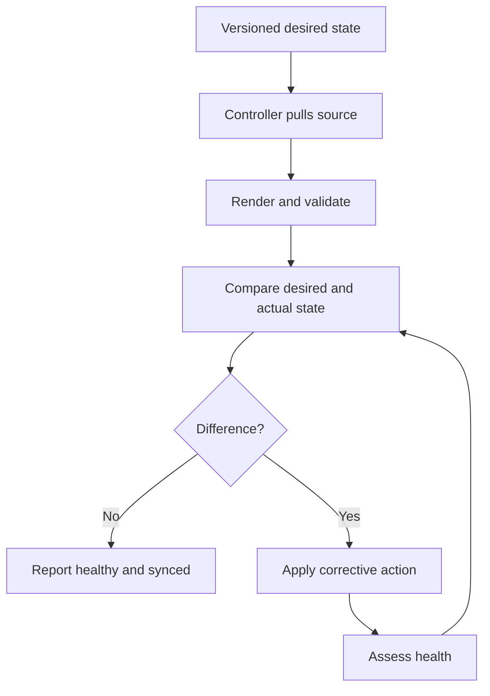

# GitOps Principles

## What GitOps Is

GitOps is an operating model for declarative systems. Approved desired state is versioned, automation retrieves it, and software agents continuously reconcile the running system toward that state.

GitOps is not merely:

- Keeping YAML in Git
- Triggering a deployment after a commit
- Running `kubectl apply` from a CI pipeline
- Using a particular product
- Renaming an existing deployment process

A system is much closer to GitOps when the complete operational loop is present.

## The Four OpenGitOps Principles

### 1. Declarative

The desired state is described rather than encoded only as a sequence of imperative steps.

Declarative example:

```yaml
apiVersion: apps/v1
kind: Deployment
metadata:
  name: demo-app
spec:
  replicas: 3
```

Imperative example:

```bash
kubectl scale deployment demo-app --replicas=3
```

The imperative command can be useful operationally, but it does not preserve the approved desired state by itself.

### 2. Versioned and Immutable

Desired state is stored with:

- Version history
- Authorship
- Review context
- A stable identifier such as a commit
- The ability to compare and revert

Git is the common implementation, but the principle is broader than a product name.

### 3. Pulled Automatically

Software agents retrieve desired-state declarations automatically.

The pull model reduces the need for an external CI worker to hold broad cluster credentials. It also lets the cluster-side controller operate continuously rather than only when a pipeline runs.

### 4. Continuously Reconciled

The controller repeatedly:

1. Reads desired state
2. Observes actual state
3. Calculates differences
4. Applies corrective actions
5. Reports status
6. Repeats

This loop is the key distinction between a one-time deployment and continuous reconciliation.

## GitOps Control Loop



## Desired State and Actual State

- **Desired state:** What the approved declaration says should exist
- **Actual state:** What the target system currently reports
- **Drift:** A meaningful difference between desired and actual state
- **Reconciliation:** The process of attempting to remove the difference
- **Convergence:** The outcome where actual state matches desired state

Not every difference is actionable. Controllers may ignore fields defaulted or mutated by other systems. Diff customization must be narrow and documented.

## Benefits

Potential benefits include:

- Repeatable delivery
- Better auditability
- Faster recovery through known-good declarations
- Lower configuration drift
- Clearer separation between build and deployment
- Pull-request-based collaboration
- Consistent multi-environment management
- A common operational interface for applications and platform components

These benefits are not automatic. Poor repository design, excessive permissions, mutable artifacts, and weak review controls can produce a fragile GitOps implementation.

## GitOps, CI/CD, and Infrastructure as Code

| Concept | Main concern |
|---|---|
| CI | Build, test, scan, and package changes |
| Continuous delivery | Keep changes releasable and automate delivery steps |
| GitOps | Continuously reconcile systems from versioned desired state |
| Infrastructure as Code | Define and provision infrastructure through code |
| Configuration management | Configure operating systems and services |

The practices overlap. Terraform can be operated through GitOps. Kubernetes manifests are Infrastructure as Code. A CI pipeline can update a GitOps repository. The terms describe different concerns rather than mutually exclusive tool categories.

## When GitOps Fits Well

GitOps is especially useful when:

- The target system has a declarative API
- Controllers can observe current state
- Teams need strong audit history
- Multiple environments should be consistent
- Changes are reviewed through Git
- Recovery should start from versioned declarations
- Platform teams manage many applications or clusters

## Limitations and Trade-offs

- Git is not a safe place for plaintext secrets
- Generated manifests can hide complexity
- Reconciliation may fight manual emergency changes
- Controller permissions are powerful
- Repository structure can become a scaling bottleneck
- Mutable image tags reduce determinism
- Stateful operations may require additional workflows
- Rollback of configuration does not automatically roll back data
- External dependencies can remain outside the reconciliation boundary
- Excessively rapid automation can propagate mistakes quickly

A mature GitOps design includes prevention, detection, response, and recovery controls.
