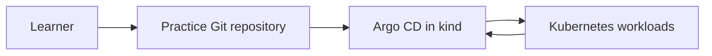

# GitOps: Fundamentals

## Session 0 — Course Introduction and Lab Setup

---

## Why This Course

Modern teams need delivery that is:

- Repeatable
- Auditable
- Recoverable
- Scalable
- Secure
- Understandable

GitOps provides an operating model, not only another deployment tool.

---

## Learning Outcomes

Participants will learn to:

- Explain the GitOps principles
- Design repository and promotion workflows
- Operate Argo CD
- Use Kustomize and Helm
- Secure the delivery path
- Scale with ApplicationSet
- Compare Argo CD and Flux
- Troubleshoot reconciliation

---

## Course Map

1. Foundations
2. Repository design
3. Argo CD
4. Synchronization
5. Helm and Kustomize
6. Security
7. Scale and automation
8. Flux and operations

---

## Required Background

- Git fundamentals
- Kubernetes basics
- YAML
- Command line
- CI/CD concepts

This is not a Kubernetes introduction.

---

## Lab Architecture



---

## Tools

Required:

- Git
- Docker
- kind
- kubectl
- Helm
- Python 3

Optional:

- Argo CD CLI
- Flux CLI
- jq and yq

---

## Safety Boundary

Use:

- Disposable cluster
- Dedicated repository
- Example credentials only
- `gitops-*` namespaces

Never use:

- Production cluster
- Real secrets
- Shared administrator tokens
- Unreviewed destructive automation

---

## Course Repository

```text
slides/      Theory
docs/        Reference
labs/        Guided practice
examples/    Reusable manifests
scripts/     Setup and validation
quizzes/     Knowledge checks
```

---

## Learning Loop

```text
Explain
  ↓
Inspect
  ↓
Render
  ↓
Commit
  ↓
Reconcile
  ↓
Observe
  ↓
Break safely
  ↓
Fix through Git
```

---

## Environment Check

```bash
make check-environment
make content-check
```

---

## Create the Cluster

```bash
make cluster-create
kubectl get nodes
```

---

## Install Argo CD

```bash
make argocd-install
kubectl get pods -n argocd
```

---

## Access Argo CD

```bash
make argocd-password
make argocd-port-forward
```

Open:

```text
https://localhost:8080
```

---

## Working Agreement

During labs:

- Read before applying
- Predict before syncing
- Commit before reconciling
- Investigate before retrying
- Clean up afterward

---

## Discussion

- How are deployments performed today?
- Where is production desired state stored?
- Who can change it?
- How is drift detected?
- How is rollback performed?
