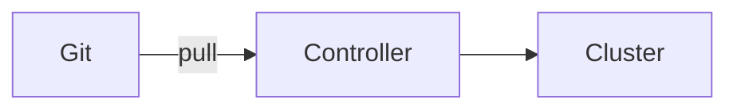
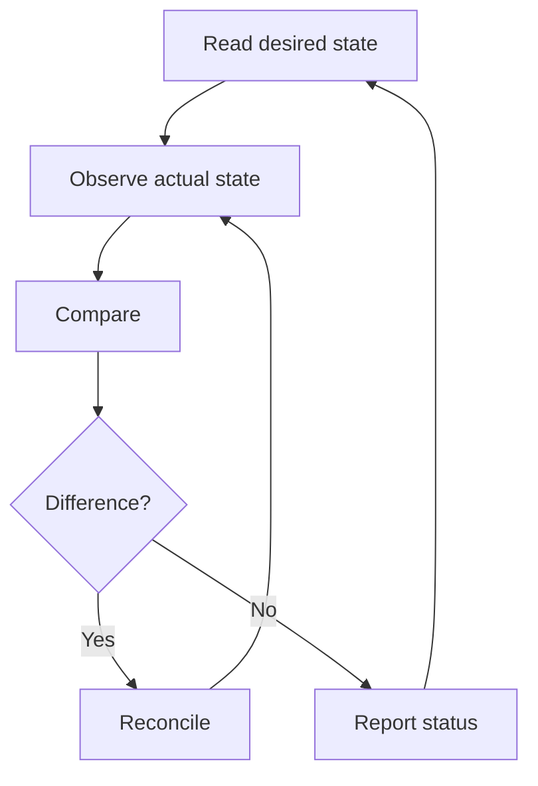

# GitOps Foundations

## Session 1

---

## GitOps in One Sentence

GitOps manages declarative systems from versioned desired state that software agents pull and continuously reconcile.

---

## GitOps Is Not Just Git

Git alone provides:

- Version history
- Collaboration
- Review
- Identity

GitOps adds:

- Automated retrieval
- Continuous comparison
- Corrective action
- Operational status

---

## Four OpenGitOps Principles

1. Declarative
2. Versioned and immutable
3. Pulled automatically
4. Continuously reconciled

All four matter.

---

## Declarative State

```yaml
spec:
  replicas: 3
```

Describes the result.

```bash
kubectl scale deployment demo --replicas=3
```

Describes an action.

---

## Versioned and Immutable

A useful desired-state change has:

- Author
- Timestamp
- Commit
- Review
- Diff
- Reason
- Revert path

---

## Pull Model



The target-side agent decides when and how to reconcile.

---

## Continuous Reconciliation



---

## Key Terms

- Desired state
- Actual state
- Drift
- Reconciliation
- Convergence
- Sync
- Health

---

## Sync Is Not Health

A Deployment can match Git perfectly while every Pod crashes.

```text
Synced + Healthy      Good
Synced + Degraded     Configuration applied, workload failing
OutOfSync + Healthy   Drift exists, workload still running
OutOfSync + Degraded  Delivery and runtime problem
```

---

## GitOps and CI

CI should usually:

- Test
- Build
- Scan
- Sign
- Publish
- Propose desired-state update

The GitOps controller should deploy.

---

## GitOps and IaC

Infrastructure as Code describes infrastructure.

GitOps describes how approved desired state is continuously operated.

Terraform, Crossplane, Kubernetes, and cloud controllers can participate in GitOps designs.

---

## Benefits

- Auditability
- Repeatability
- Drift detection
- Reduced cluster credentials in CI
- Faster recovery
- Consistent environments
- Pull-request collaboration

---

## Trade-offs

- Powerful automation
- Repository scaling
- Secret management
- Controller permissions
- Data rollback limits
- Reconciliation conflicts
- Operational learning curve

---

## Manual Change Scenario

An engineer runs:

```bash
kubectl scale deployment demo-app --replicas=10
```

Questions:

- Is this an incident response?
- Will self-healing revert it?
- Should Git be updated?
- Who owns the field?
- What is the audit trail?

---

## Git as Production API

With automated sync:

```text
Write access to production Git
≈
Ability to change production
```

Protect it accordingly.

---

## Knowledge Check

- Which principle distinguishes reconciliation from a one-time pipeline?
- Why is a Kubernetes Secret unsafe in public Git?
- Can an application be synced and unhealthy?
- Is every Git-based deployment GitOps?
