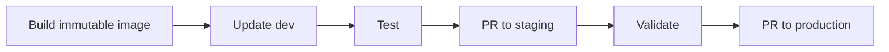

# Repository and Delivery Design

## Session 2

---

## Design Goal

Make desired state:

- Discoverable
- Reviewable
- Reproducible
- Scoped
- Promotable
- Recoverable

---

## Two Repository Roles

```text
Application repository
  source, tests, Dockerfile

GitOps repository
  environment configuration, versions, manifests
```

Separation is common, not mandatory.

---

## Single Repository

Advantages:

- Simple
- Atomic changes
- Easy discovery

Trade-offs:

- Mixed permissions
- Large repository
- Shared release history

---

## Separate GitOps Repository

Advantages:

- Clear audit history
- Dedicated controls
- Build and deploy separation
- Central governance

Trade-offs:

- Cross-repository automation
- Version coordination
- More administration

---

## Environment Folders

```text
apps/demo-app/
├── base/
└── overlays/
    ├── dev/
    ├── staging/
    └── prod/
```

The course uses this model.

---

## Environment Branches

```text
dev
staging
production
```

Risks:

- Long-lived divergence
- Difficult merges
- Hidden environment difference
- Complex branch permissions

Use only with a clear reason.

---

## Promotion



Promote the same artifact.

---

## Immutable Artifact

Preferred:

```text
registry.example.com/demo@sha256:abc...
```

Acceptable with controlled registry:

```text
registry.example.com/demo:1.4.3
```

Avoid:

```text
registry.example.com/demo:latest
```

---

## Repository Naming Is an API

Generators may infer behavior from:

- Folder names
- File names
- Labels
- Environment names
- Cluster metadata

Changing conventions can change generated Applications.

---

## Ownership

Document:

- Application owner
- Platform owner
- Security reviewer
- Production approver
- Incident contact
- Repository administrator

Use `CODEOWNERS` for critical paths.

---

## Change Granularity

Prefer one understandable intent per pull request.

Good:

```text
promote demo-app 1.4.2 to staging
```

Risky:

```text
upgrade 27 apps, change ingress, rotate secrets, and edit RBAC
```

---

## Rendered Diff

Review both:

- Source diff
- Generated Kubernetes diff

Template changes can produce large operational effects from a small source change.

---

## Anti-Patterns

- Plaintext secrets
- Mutable tags
- Unrestricted Git writes
- CI and GitOps owning the same resource
- Production tracking a developer branch
- Undocumented manual changes
- Non-reproducible generation

---

## Design Exercise

For your organization:

- One repository or multiple?
- Folder or branch environments?
- Who approves production?
- How is a version promoted?
- What is the rollback path?
- What is the maximum blast radius?
