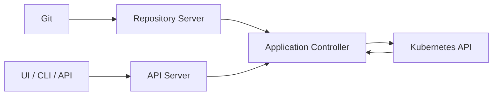

# Argo CD Fundamentals

## Session 3

---

## What Argo CD Is

A declarative GitOps continuous delivery tool for Kubernetes.

It compares desired manifests with live resources and reports or corrects differences.

---

## Main Components

- API server
- Repository server
- Application controller
- ApplicationSet controller
- Redis
- Optional identity integration

---

## Architecture



---

## Application Resource

An `Application` connects:

- Project
- Source
- Revision
- Path or chart
- Destination
- Sync policy

---

## Minimal Application

```yaml
apiVersion: argoproj.io/v1alpha1
kind: Application
metadata:
  name: demo-app
  namespace: argocd
spec:
  project: default
  source:
    repoURL: https://github.com/example/gitops.git
    targetRevision: main
    path: apps/demo/overlays/dev
  destination:
    server: https://kubernetes.default.svc
    namespace: demo-dev
```

---

## Source Types

Argo CD supports:

- Plain YAML
- Kustomize
- Helm
- Jsonnet
- Multiple sources
- Config-management plugins

---

## Destination

A destination identifies:

- Cluster API server or cluster name
- Namespace

The default in-cluster server is:

```text
https://kubernetes.default.svc
```

---

## Target Revision

Can identify:

- Branch
- Tag
- Commit
- Supported chart version

Production should use an explicit promotion policy.

---

## Sync Status

- Synced
- OutOfSync
- Unknown

---

## Health Status

- Healthy
- Progressing
- Degraded
- Suspended
- Missing
- Unknown

---

## Manual Sync

Advantages:

- Good for learning
- Human checkpoint
- Easy controlled rollout

Trade-off:

- Human action is required after every approved change

---

## Declarative Bootstrap

Prefer storing Argo CD resources in Git:

- AppProjects
- Applications
- ApplicationSets
- RBAC and notifications where practical

This creates an "app of apps" or bootstrap pattern.

---

## First Application Flow

1. Commit manifests
2. Apply Application definition
3. Argo CD fetches source
4. Inspect diff
5. Sync
6. Check health
7. Change Git
8. Reconcile again

---

## UI Versus CLI Versus YAML

- UI: exploration and visualization
- CLI: operations and automation
- YAML: reproducible desired state

Production configuration should not exist only as UI clicks.

---

## Lab Focus

- Install Argo CD
- Access UI
- Apply first Application
- Inspect desired and live state
- Sync and validate
