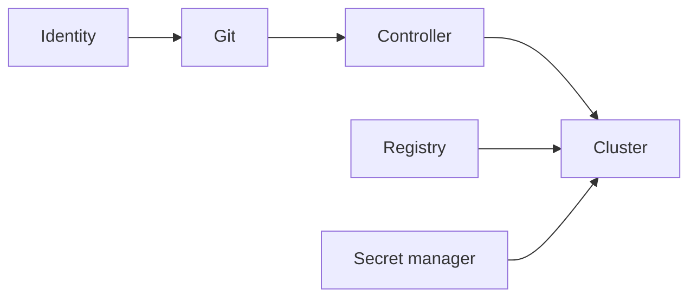

# Security and Governance

## Session 6

---

## GitOps Security Boundary



Every link needs controls.

---

## Git Write Access

With automated reconciliation, repository write access can change production.

Controls:

- MFA
- Protected branches
- Reviews
- CODEOWNERS
- Status checks
- Audit logs
- Restricted automation

---

## AppProject

An AppProject restricts:

- Source repositories
- Destination clusters
- Destination namespaces
- Cluster resource types
- Namespace resource types
- Project roles
- Sync windows

---

## Least Privilege

Avoid:

```yaml
sourceRepos:
  - "*"
destinations:
  - namespace: "*"
    server: "*"
```

Prefer explicit boundaries.

---

## Two RBAC Layers

### Argo CD RBAC

Who can:

- View
- Sync
- Update
- Delete
- Manage repositories
- Manage clusters

### Kubernetes RBAC

What the controller can create or change.

Both matter.

---

## Secrets

Base64 is not encryption.

Never commit real plaintext secrets.

---

## Secret Patterns

- External Secrets
- Sealed Secrets
- SOPS
- Secrets Store CSI Driver
- Platform-specific secret operators

Choose based on lifecycle, trust, and recovery.

---

## Repository Credentials

Use:

- Dedicated machine identity
- Read-only access
- Short-lived tokens
- SSH deploy keys
- Rotation
- Host verification

Avoid personal administrator tokens.

---

## Supply Chain

Validate:

- Source identity
- Build provenance
- Artifact signature
- Image digest
- Registry
- Chart source
- Git revision
- Rendered policy

---

## Config-Management Plugins

Plugins may execute repository-supplied logic.

Treat them as code execution.

- Pin images
- Isolate
- Review
- Restrict repositories
- Remove unnecessary tools

---

## Sync Windows

Govern when changes may reconcile.

Do not use windows to compensate for weak testing.

---

## Break Glass

Must be:

- Explicit
- Time-limited
- Audited
- Narrow
- Reconciled back to Git
- Reviewed afterward

---

## Multi-Tenancy Decision

Options:

- Shared Argo CD with projects
- Separate instances by environment
- Separate instances by tenant
- Per-cluster instances

Security boundary drives topology.

---

## Lab Focus

- Create AppProject
- Restrict source and destination
- Test a denied Application
- Discuss RBAC
- Add a sync window
- Design a secret strategy
