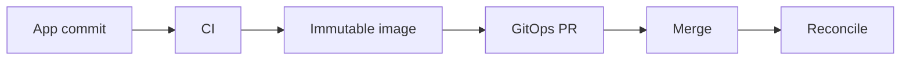

# Scale, ApplicationSet, and CI

## Session 7

---

## Scaling Problem

Manual Applications do not scale well across:

- Many environments
- Many clusters
- Many tenants
- Many applications

ApplicationSet generates Applications.

---

## Generator + Template

```text
Generator data
      +
Application template
      =
Generated Applications
```

---

## List Generator

Useful for a controlled set:

- dev
- staging
- prod

Explicit and easy to understand.

---

## Git Generator

Discovers:

- Directories
- Files

Repository layout becomes automation input.

Validate naming carefully.

---

## Cluster Generator

Uses registered clusters and labels.

Example labels:

```text
environment=prod
region=eu-west
tenant=payments
```

---

## Matrix Generator

Combines dimensions:

```text
applications × clusters
```

Powerful but potentially high blast radius.

---

## ApplicationSet Deletion

Understand:

- Generated Application ownership
- Finalizers
- Workload pruning
- Cluster removal behavior

Test before production.

---

## CI Boundary

CI should:

- Test
- Build
- Scan
- Publish
- Propose GitOps update

CI should not normally need cluster-admin access.

---

## Image Promotion



---

## Jenkins Example

Stages:

1. Test
2. Build
3. Publish
4. Clone GitOps repository
5. Update Kustomize image
6. Validate
7. Open pull request

---

## GitHub Actions Example

Use:

- Repository-scoped identity
- Input validation
- Path filters
- Concurrency
- Pull requests
- Required reviews

Avoid direct production push.

---

## Commit Loop Risk

Automation may trigger itself.

Prevent with:

- Separate repositories
- Path filters
- Change detection
- Bot identity
- Pull requests
- Concurrency groups

---

## Multi-Cluster Topology

- Central controller
- Per-cluster controller
- Hub-and-spoke

Balance visibility, isolation, and operations.

---

## Fleet Safety

- Progressive rollout
- Concurrency limits
- Representative canary clusters
- Sync windows
- Separate critical environments
- Good metrics and alerts

---

## Lab Focus

- Generate three Applications
- Inspect ownership
- Add another environment
- Simulate CI image update
- Review pull-request controls
