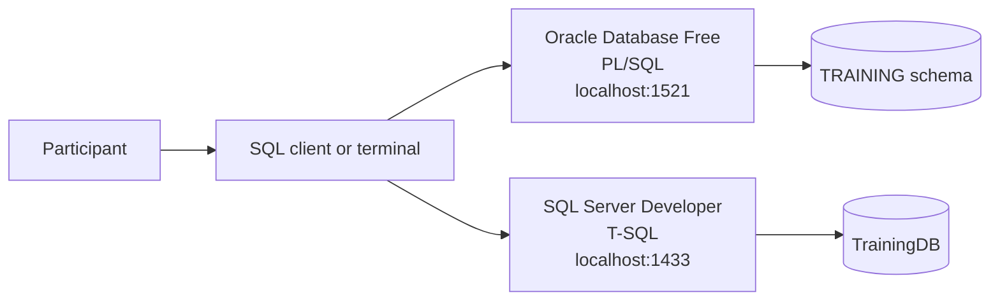

# PL/SQL & T-SQL Database Programming: Fundamentals

A practical, reusable course for learning procedural database programming with **Oracle PL/SQL** and **Microsoft SQL Server T-SQL**.

The course uses the same small employee-management domain in both database systems so participants can compare syntax, behavior, tooling, transactions, error handling, stored program units, triggers, and operational trade-offs without being distracted by different business models.

---

## Course Objectives

By the end of this course participants will be able to:

- Explain the relationship between standard SQL, PL/SQL, and T-SQL
- Create and query relational tables using portable SQL concepts
- Declare variables and use conditional and iterative control flow
- Write anonymous PL/SQL blocks and T-SQL batches
- Create stored procedures and scalar functions
- Understand Oracle packages and SQL Server schemas
- Process query results with explicit and implicit cursors
- Prefer set-based operations when procedural loops are unnecessary
- Handle errors with PL/SQL exceptions and T-SQL `TRY...CATCH`
- Control transactions with `COMMIT`, `ROLLBACK`, and savepoints
- Create audit triggers and understand their risks
- Apply basic security, performance, testing, and maintainability practices
- Translate common database-programming patterns between Oracle and SQL Server

---

## Course Structure

### Session 0 - Course Introduction

- Scope, prerequisites, and learning approach
- SQL versus procedural SQL extensions
- Shared training domain and lab architecture

### Session 1 - Relational and SQL Foundations

- Tables, keys, constraints, and relationships
- Data types and vendor differences
- DDL, DML, queries, joins, grouping, and subqueries
- NULL behavior and three-valued logic

### Session 2 - Oracle and SQL Server Environments

- Oracle Database, schemas, users, and pluggable databases
- SQL Server instances, databases, schemas, and logins
- SQL*Plus, SQLcl, `sqlcmd`, VS Code, and graphical clients
- Batch terminators: `/` and `GO`

### Session 3 - Procedural Language Fundamentals

- Blocks, batches, variables, constants, and data types
- `IF`, `CASE`, loops, and output
- `%TYPE`, `%ROWTYPE`, table variables, and temporary structures
- Scope and naming conventions

### Session 4 - Procedures, Functions, and Packages

- Input and output parameters
- Stored procedures and scalar functions
- Oracle package specification and body
- SQL Server schemas and programmable objects
- Dependency management and API design

### Session 5 - Query Processing and Cursors

- Implicit and explicit cursors
- Cursor attributes and row-by-row processing
- T-SQL cursor syntax
- Set-based alternatives
- Avoiding the row-by-row performance trap

### Session 6 - Exceptions, Errors, and Transactions

- PL/SQL predefined and user-defined exceptions
- T-SQL `TRY...CATCH`, `THROW`, and error metadata
- Transaction boundaries and nested-call behavior
- Savepoints, rollback strategies, and `XACT_STATE()`

### Session 7 - Triggers, Performance, Security, and Testing

- Row-level and statement-level trigger behavior
- Audit examples and multi-row correctness
- Least privilege and ownership boundaries
- Bind parameters, plan reuse, indexing, and instrumentation
- Unit-testable database APIs and deployment discipline

### Session 8 - Comparative Workshop

- Implement the same feature in both platforms
- Review syntax and semantic differences
- Diagnose transaction and trigger defects
- Complete the final challenge and knowledge check

---

## Lab Architecture



The optional local lab uses:

- `gvenzl/oracle-free:23-slim-faststart` for Oracle Database Free
- `mcr.microsoft.com/mssql/server:2022-latest` for SQL Server Developer
- Docker Compose for lifecycle management
- Persistent named volumes, removable with `make clean`

The Oracle image is a community-maintained container build based on Oracle Database Free. Review its license and documentation before use. The SQL Server container requires acceptance of the Microsoft SQL Server container EULA.

---

## Repository Structure

```text
plsql-tsql-database-programming-fundamentals/
├── README.md
├── MANIFEST.md
├── LICENSE.md
├── Makefile
├── .env.example
├── .gitignore
├── slides/
│   ├── 00_course_introduction.md
│   ├── 01_relational_and_sql_foundations.md
│   ├── 02_oracle_and_sql_server_environments.md
│   ├── 03_procedural_language_fundamentals.md
│   ├── 04_procedures_functions_and_packages.md
│   ├── 05_query_processing_and_cursors.md
│   ├── 06_exceptions_errors_and_transactions.md
│   └── 07_triggers_performance_security_and_testing.md
├── docs/
│   ├── setup_guide.md
│   ├── plsql_vs_tsql.md
│   ├── cheat_sheet.md
│   ├── glossary.md
│   ├── instructor_guide.md
│   ├── security_and_operations.md
│   ├── troubleshooting.md
│   └── useful_links.md
├── labs/
│   ├── README.md
│   ├── 01_start_and_verify_databases.md
│   ├── 02_query_the_shared_schema.md
│   ├── 03_blocks_variables_and_control_flow.md
│   ├── 04_procedures_functions_and_packages.md
│   ├── 05_cursors_and_set_based_processing.md
│   ├── 06_exceptions_and_transactions.md
│   └── 07_triggers_and_final_challenge.md
├── examples/
│   ├── oracle/
│   ├── sqlserver/
│   └── comparison/
├── lab/
│   ├── docker-compose.yml
│   ├── oracle/init/
│   └── sqlserver/init/
├── scripts/
│   ├── validate_content.py
│   └── wait_for_databases.sh
└── quizzes/
    ├── 01_fundamentals.md
    └── 02_scenarios.md
```

---

## Prerequisites

Recommended knowledge:

- Basic relational database concepts
- Basic SQL: `SELECT`, `INSERT`, `UPDATE`, `DELETE`, joins, and aggregates
- Basic command-line usage
- Git and a text editor

For the optional local lab:

- Linux, macOS, or Windows with WSL2
- Docker Engine and Docker Compose
- At least 6 GB of free memory for both databases together
- At least 15 GB of free disk space for images and persistent data
- An x86-64 host for the supported SQL Server Linux container configuration
- Optional: `make`

Participants may also use existing authorized Oracle and SQL Server environments. Never run training scripts against production databases.

---

## Quick Start

Create the local environment file:

```bash
cp .env.example .env
```

Review and change the example passwords, then validate the package:

```bash
make validate
```

Start both databases, wait for readiness, and initialize SQL Server:

```bash
make up
```

Show container status:

```bash
make status
```

Open an Oracle SQL*Plus session as the training user:

```bash
make oracle-shell
```

Open a SQL Server `sqlcmd` session in `TrainingDB`:

```bash
make mssql-shell
```

Run verification queries:

```bash
make verify
```

Stop the containers while keeping data:

```bash
make down
```

Remove containers and all local database volumes:

```bash
make clean
```

`make clean` permanently deletes the local training data.

---

## Connection Details

| Platform | Host | Port | Database / service | Training user |
|---|---:|---:|---|---|
| Oracle Database Free | `localhost` | `1521` | `FREEPDB1` | value of `ORACLE_APP_USER` |
| SQL Server | `localhost` | `1433` | `TrainingDB` | `sa` for the local lab |

For real environments, create a dedicated least-privileged login instead of using administrative accounts.

---

## Recommended Learning Approach

For each session:

1. Review the corresponding Markdown slide deck.
2. Read the comparison notes for the topic.
3. Execute the Oracle example.
4. Execute the SQL Server example.
5. Explain behavioral differences, not only syntax differences.
6. Modify the example and predict the result before running it.
7. Complete the associated lab and knowledge-check questions.

The course can be delivered as:

- A 60-minute comparison and awareness session
- Two 90-minute sessions with demonstrations
- A half-day workshop with selected labs
- A full-day hands-on course with the final challenge

---

## Safety and Security Notes

- Use only isolated, authorized training environments.
- Never store real credentials in `.env`, SQL files, shell history, or source control.
- Do not expose ports `1433` or `1521` to untrusted networks.
- Do not use `SYS`, `SYSTEM`, or `sa` for application workloads.
- Review every `UPDATE` and `DELETE` statement with a matching `SELECT` first.
- Keep transactions short and handle rollback paths explicitly.
- Avoid dynamic SQL unless it is necessary, parameterized, and reviewed.
- Treat triggers as hidden execution paths that require tests and documentation.
- Use least privilege for object creation and execution permissions.
- Remove the local lab volumes when they are no longer needed.

---

## License

Educational content, including presentations, documentation, diagrams, exercises, and quizzes, is licensed under the **Creative Commons Attribution-NonCommercial-ShareAlike 4.0 International License**.

Source code, scripts, SQL examples, and executable configuration are licensed under the **MIT License**.

Oracle, Oracle Database, PL/SQL, Microsoft, SQL Server, and T-SQL are trademarks of their respective owners. Container images and third-party components remain subject to their own licenses and terms.

## Author

**Vladislav Iliev**

[LinkedIn](https://www.linkedin.com/in/vld62/)
