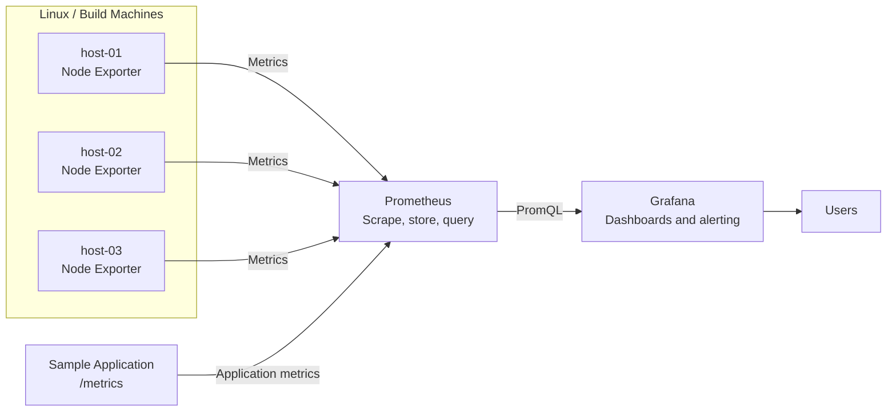

# Prometheus & Grafana: Basics

A practical, reusable course for learning metrics-based monitoring with Prometheus and Grafana.

The training uses a local Docker Compose lab and an end-to-end example in which Linux machines expose system metrics through Node Exporter, Prometheus collects and stores the metrics, and Grafana presents dashboards to users.

---

## Course Objectives

By the end of this course participants will:

- Understand the role of metrics in monitoring and observability
- Understand Prometheus architecture and the pull-based collection model
- Work with metric names, labels, time series, exporters, and scrape targets
- Monitor Linux machines with Node Exporter
- Write practical PromQL queries
- Configure Prometheus scrape jobs and file-based target discovery
- Connect Grafana to Prometheus
- Build and provision Grafana dashboards
- Understand alert rules, labels, annotations, and notification concepts
- Implement a reusable monitoring stack with Docker Compose

---

## Course Structure

### Session 0 – Course Introduction

- Course goals and learning approach
- Monitoring architecture
- Lab environment and prerequisites
- End-to-end use case

### Session 1 – Monitoring and Observability Basics

- Monitoring versus observability
- Metrics, logs, and traces
- Symptoms versus causes
- Common infrastructure signals

### Session 2 – Prometheus Architecture and Metrics

- Prometheus server and time-series database
- Pull-based collection
- Targets, jobs, and instances
- Metric types and labels
- Cardinality considerations

### Session 3 – Exporters and Target Discovery

- Exporter pattern
- Node Exporter
- Static target configuration
- File-based service discovery
- Target health and troubleshooting

### Session 4 – PromQL Basics

- Instant and range vectors
- Label selectors
- Rates and aggregations
- CPU, memory, disk, and availability queries
- Query troubleshooting

### Session 5 – Grafana Dashboards

- Prometheus data source
- Explore view
- Panels and visualizations
- Variables and reusable dashboards
- File-based provisioning

### Session 6 – Alerting and Operations

- Alert rule design
- Labels and annotations
- Avoiding noisy alerts
- Retention, persistence, security, and backup
- Operational validation

### Session 7 – End-to-End Monitoring Lab

- Start the monitoring stack
- Generate application traffic
- Verify scrape targets
- Run PromQL queries
- Inspect the provisioned dashboard
- Add additional Linux hosts
- Review production hardening steps

---

## Architecture



The course diagram intentionally uses generic hostnames and contains no organization-specific infrastructure information.

---

## Repository Structure

```text
prometheus-grafana-basics/
├── README.md
├── MANIFEST.md
├── Makefile
├── .env.example
├── .gitignore
├── slides/
├── docs/
├── exercises/
└── lab/
    ├── docker-compose.yml
    ├── prometheus/
    │   ├── prometheus.yml
    │   ├── alerts.yml
    │   └── targets/
    ├── grafana/
    │   ├── dashboards/
    │   └── provisioning/
    ├── sample-app/
    └── scripts/
```

---

## Prerequisites

- Linux, macOS, or Windows with WSL2
- Docker Engine and Docker Compose
- Git
- `curl`
- Optional: `make`

The host-monitoring part of the lab is designed primarily for Linux. On Docker Desktop, Node Exporter may report metrics for the Docker virtual machine rather than the physical host.

---

## Quick Start

Copy the environment template:

```bash
cp .env.example .env
```

Validate the configuration:

```bash
make validate
```

Start the lab:

```bash
make up
```

Open the services:

| Service | Address |
|---|---|
| Prometheus | http://localhost:9090 |
| Grafana | http://localhost:3000 |
| Sample application | http://localhost:8000 |
| Node Exporter metrics | http://localhost:9100/metrics |

Grafana credentials are configured in `.env`. The example credentials are suitable only for a local training environment.

Generate sample traffic:

```bash
curl http://localhost:8000/
curl http://localhost:8000/slow
curl -i http://localhost:8000/error
```

Inspect Prometheus targets:

```text
http://localhost:9090/targets
```

Stop the lab:

```bash
make down
```

---

## Example PromQL Queries

Target availability:

```promql
up
```

CPU utilization:

```promql
100 - (
  avg by (instance) (
    rate(node_cpu_seconds_total{job="linux-hosts", mode="idle"}[5m])
  ) * 100
)
```

Memory utilization:

```promql
100 * (
  1 -
  node_memory_MemAvailable_bytes{job="linux-hosts"}
  /
  node_memory_MemTotal_bytes{job="linux-hosts"}
)
```

Application request rate:

```promql
sum by (endpoint) (
  rate(sample_http_requests_total[5m])
)
```

---

## Adding Additional Linux Hosts

1. Install Node Exporter on each Linux host.
2. Restrict network access to the exporter port.
3. Add generic target entries to:

```text
lab/prometheus/targets/linux-hosts.yml
```

Example:

```yaml
- targets:
    - host-01.example.internal:9100
    - host-02.example.internal:9100
  labels:
    environment: training
    role: build-machine
```

4. Reload or restart Prometheus.
5. Verify the new targets in the Prometheus targets page.
6. Use Grafana variables to switch between hosts.

See [Multi-host Deployment](docs/multi_host_deployment.md) for a complete example.

---

## Recommended Learning Approach

For each session:

1. Review the Markdown slides.
2. Run the associated lab commands.
3. Inspect the raw metrics.
4. write and test PromQL queries.
5. Complete the exercises.
6. Discuss production trade-offs.

---

## Security Notice

This repository is a training lab, not a production deployment.

Before production use:

- Put Grafana and Prometheus behind authentication and TLS
- Restrict Node Exporter and metrics endpoint network access
- Store credentials outside Git
- Define retention and storage capacity
- Back up dashboards, rules, and configuration
- Use supported, patched container versions
- Review label cardinality and sensitive metric content

See [Security Notes](docs/security_notes.md).

---

## License

Educational content, including presentations, documentation, diagrams, and exercises, is licensed under the Creative Commons Attribution-NonCommercial-ShareAlike 4.0 International License.

Source code, configuration, scripts, and executable examples are licensed under the MIT License.

Third-party trademarks and referenced materials remain subject to their respective owners and licenses.
