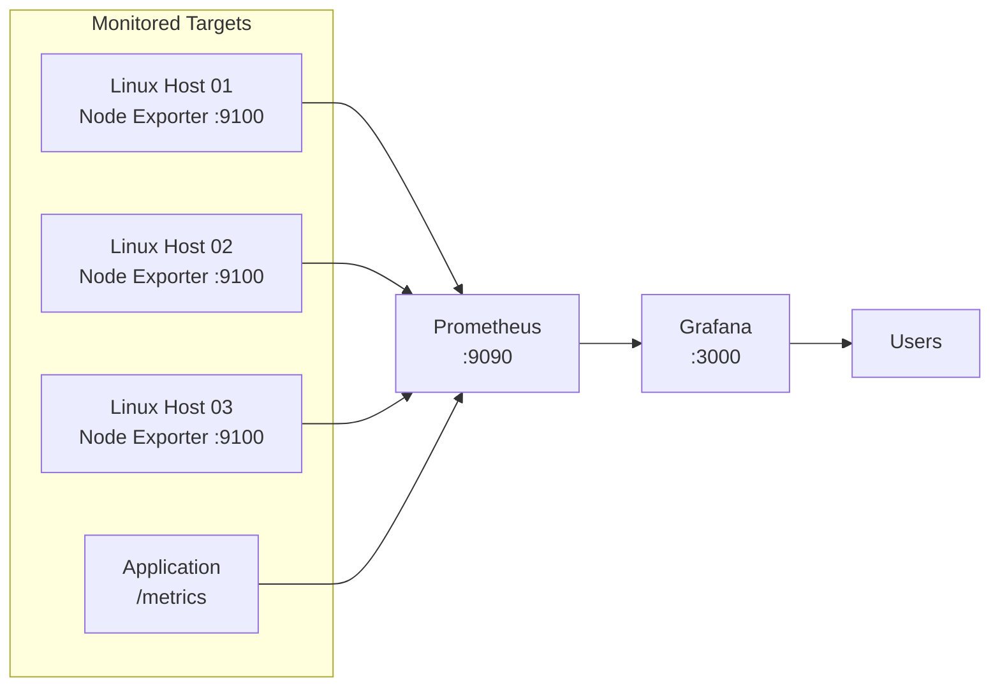

# Monitoring Architecture

## Generic Reference Architecture



## Data Flow

1. Exporters and applications expose HTTP metrics endpoints.
2. Prometheus discovers configured targets.
3. Prometheus periodically scrapes the endpoints.
4. Samples are stored as labeled time series.
5. Grafana sends PromQL queries to Prometheus.
6. Users inspect dashboards and alerts.

## Responsibilities

### Monitored Hosts

- Run Node Exporter
- Permit access only from authorized monitoring systems
- Keep the exporter patched
- Expose no secrets through textfile collectors or custom labels

### Prometheus

- Target discovery
- Scraping
- Time-series storage
- PromQL
- Rule evaluation

### Grafana

- Data-source access
- Visualization
- Dashboard organization
- User access
- Grafana-managed alerting when configured

## Public Example Naming

Use names such as:

```text
host-01.example.internal
build-node-01.example.internal
monitoring.example.test
```
