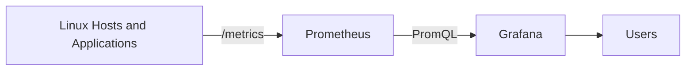

# Session 0 – Course Introduction

## Prometheus & Grafana: Basics

A practical introduction to metrics collection, querying, visualization, and operational monitoring.

---

## Why This Course?

Operational teams need to answer questions such as:

- Are all systems reachable?
- Which host is overloaded?
- Is memory pressure increasing?
- Is disk space running out?
- Is an application returning errors?
- Did a deployment change system behavior?

Prometheus and Grafana provide a common open-source approach for answering these questions with metrics.

---

## Learning Outcomes

Participants will learn how to:

- Expose and collect metrics
- Configure scrape targets
- Query time series with PromQL
- Create reusable dashboards
- Define actionable alerts
- Operate a basic monitoring stack

---

## End-to-End Flow

---

## Training Lab

The local lab contains:

- Prometheus
- Grafana
- Node Exporter
- A small instrumented application
- Provisioned data source and dashboard
- Example alert rules

---

## Course Sessions

0. Course Introduction
1. Monitoring and Observability Basics
2. Prometheus Architecture and Metrics
3. Exporters and Target Discovery
4. PromQL Basics
5. Grafana Dashboards
6. Alerting and Operations
7. End-to-End Monitoring Lab

---

## Public Repository Rule

Use only:

- Generic hostnames
- Example domains
- Synthetic metrics
- Test credentials

Never publish internal infrastructure names, production URLs, IP addresses, access tokens, or screenshots containing confidential data.
