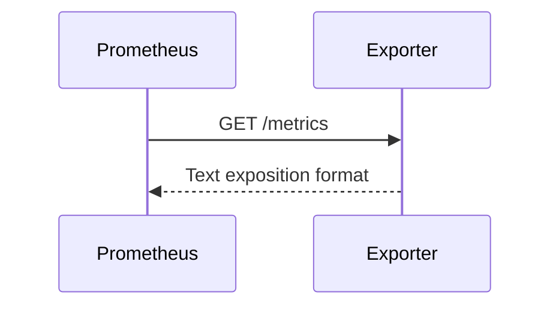

# Session 2 – Prometheus Architecture and Metrics

## Prometheus Responsibilities

Prometheus:

- Discovers or receives a list of targets
- Scrapes HTTP metrics endpoints
- Stores samples in a time-series database
- Evaluates PromQL queries
- Evaluates recording and alert rules
- Exposes an API and web interface

---

## Pull-Based Collection

Prometheus normally pulls metrics from targets.



Advantages:

- Central control of scrape intervals
- Direct target health visibility
- Simple debugging with HTTP tools
- Clear ownership of collection configuration

---

## Jobs and Instances

A **job** groups targets with the same purpose.

An **instance** identifies one scraped endpoint.

Example:

```yaml
scrape_configs:
  - job_name: linux-hosts
    static_configs:
      - targets:
          - host-01.example.internal:9100
          - host-02.example.internal:9100
```

Prometheus automatically adds labels such as:

```text
job="linux-hosts"
instance="host-01.example.internal:9100"
```

---

## Metric Data Model

Example:

```text
http_requests_total{
  method="GET",
  endpoint="/api/orders",
  status="200"
} 12548
```

Components:

- Metric name
- Labels
- Numeric sample
- Timestamp

---

## Metric Types

### Counter

Only increases, except when a process restarts.

Examples:

- Requests
- Errors
- Bytes sent

### Gauge

Can increase or decrease.

Examples:

- Memory usage
- Queue depth
- Temperature

### Histogram

Counts observations in buckets and records count and sum.

Examples:

- Request duration
- Payload size

### Summary

Calculates client-side quantiles and observation totals.

---

## Cardinality

Every unique label combination creates another time series.

Avoid labels such as:

- User ID
- Request ID
- Full URL with dynamic values
- Timestamp
- Random identifiers

High cardinality increases memory, storage, and query cost.

---

## Raw Metrics Inspection

```bash
curl http://localhost:9100/metrics
curl http://localhost:8000/metrics
```

Inspecting the raw endpoint is often the fastest troubleshooting step.
