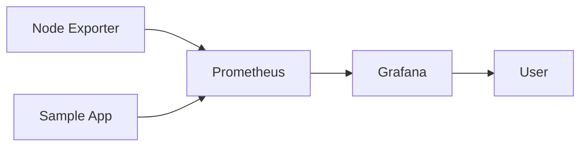

# Session 7 – End-to-End Monitoring Lab

## Goal

Implement and validate this flow:



---

## Step 1 – Prepare the Environment

```bash
cp .env.example .env
make validate
```

Review the version and credential values before starting the stack.

---

## Step 2 – Start the Stack

```bash
make up
make ps
```

Services:

- Prometheus: `http://localhost:9090`
- Grafana: `http://localhost:3000`
- Sample application: `http://localhost:8000`
- Node Exporter: `http://localhost:9100/metrics`

---

## Step 3 – Verify Raw Metrics

```bash
curl http://localhost:9100/metrics
curl http://localhost:8000/metrics
```

Find:

```text
node_uname_info
node_memory_MemTotal_bytes
sample_http_requests_total
sample_http_request_duration_seconds
```

---

## Step 4 – Verify Targets

Open:

```text
http://localhost:9090/targets
```

Expected jobs:

- `prometheus`
- `linux-hosts`
- `sample-app`

All targets should be healthy.

---

## Step 5 – Generate Traffic

```bash
make generate-load
```

Or manually:

```bash
curl http://localhost:8000/
curl http://localhost:8000/slow
curl -i http://localhost:8000/error
```

---

## Step 6 – Run PromQL Queries

```promql
up
```

```promql
sum by (endpoint, status) (
  rate(sample_http_requests_total[5m])
)
```

```promql
histogram_quantile(
  0.95,
  sum by (le, endpoint) (
    rate(sample_http_request_duration_seconds_bucket[5m])
  )
)
```

---

## Step 7 – Inspect Grafana

1. Sign in.
2. Open the **Training** folder.
3. Open **Linux Host Overview**.
4. Select a target from the instance variable.
5. Change the dashboard time range.
6. Compare dashboard values with Prometheus queries.

---

## Step 8 – Review Alert Rules

Open:

```text
http://localhost:9090/rules
```

Inspect:

- InstanceDown
- HighCpuUsage
- HighMemoryUsage
- LowDiskSpace
- SampleAppHighErrorRate

Discuss whether each alert is actionable.

---

## Step 9 – Add a Remote Host

1. Install Node Exporter on a test Linux machine.
2. Restrict access to the Prometheus server.
3. Add the host to `lab/prometheus/targets/linux-hosts.yml`.
4. Restart or reload Prometheus.
5. Verify the target.
6. Select it in Grafana.

Use only authorized training systems.

---

## Completion Criteria

- Stack starts without configuration errors
- Prometheus scrapes all lab targets
- PromQL queries return expected data
- Grafana dashboard loads automatically
- Sample application metrics react to generated traffic
- Participants can explain how another Linux host would be added
