# Python Scripting: Basics

A practical, reusable training course for learning Python scripting, automation, and object-oriented programming.

The course begins with small command-line scripts and gradually introduces reusable functions, modules, packages, file processing, command-line interfaces, logging, configuration, testing, and maintainable object-oriented design.

---

## Course Objectives

By the end of this course participants will be able to:

- Create and use Python virtual environments
- Write portable Python scripts with explicit entry points and exit codes
- Work with strings, numbers, lists, tuples, dictionaries, and sets
- Use conditions, loops, comprehensions, and common built-in functions
- Design reusable functions with type hints and clear responsibilities
- Organize code into modules and packages
- Read and write text, JSON, and CSV files
- Work safely with paths through `pathlib`
- Handle expected failures with meaningful exceptions
- Build command-line tools with `argparse`
- Add logging and predictable configuration precedence
- Create classes, objects, methods, properties, and dataclasses
- Apply encapsulation, inheritance, composition, abstract base classes, and protocols
- Write automated tests with `unittest`
- Apply formatting, linting, documentation, and maintainability practices
- Build an object-oriented automation utility

---

## Target Audience

This training is suitable for:

- System administrators and DevOps engineers automating operational work
- Developers who want a structured introduction to Python scripting
- QA, support, and platform engineers who create command-line utilities
- Learners with basic programming knowledge who are new to Python
- Python beginners who want a practical introduction to OOP

Basic command-line knowledge is helpful but not required.

---

## Course Structure

| Session | Topic |
|---:|---|
| 0 | Course introduction and environment setup |
| 1 | Python script fundamentals |
| 2 | Data types, collections, and control flow |
| 3 | Functions, modules, and packages |
| 4 | Files, paths, JSON, CSV, and exceptions |
| 5 | CLI arguments, logging, and configuration |
| 6 | OOP fundamentals: classes and objects |
| 7 | OOP design: inheritance, composition, ABCs, and protocols |
| 8 | Testing, type hints, code quality, and packaging |
| 9 | Final automation project workshop |

---

## Learning Path

```mermaid
flowchart LR
    A[Environment] --> B[Script basics]
    B --> C[Collections and control flow]
    C --> D[Functions and modules]
    D --> E[Files and exceptions]
    E --> F[CLI and logging]
    F --> G[Classes and objects]
    G --> H[Composition and interfaces]
    H --> I[Testing and quality]
    I --> J[Automation project]
```



---

## Repository Structure

```text
python-scripting-oop-basics/
├── README.md
├── MANIFEST.md
├── LICENSE.md
├── Makefile
├── requirements.txt
├── .gitignore
├── slides/
├── docs/
├── labs/
├── examples/
├── scripts/
└── quizzes/
```

---

## Getting Started

Clone the main repository and enter the module:

```bash
git clone https://github.com/VLD62/technical-trainings.git
cd technical-trainings/python-scripting-oop-basics
```

Create and activate a virtual environment:

```bash
python3 -m venv .venv
source .venv/bin/activate
python -m pip install --upgrade pip
python -m pip install -r requirements.txt
```

Windows PowerShell:

```powershell
py -m venv .venv
.venv\Scripts\Activate.ps1
python -m pip install --upgrade pip
python -m pip install -r requirements.txt
```

Validate the environment and repository:

```bash
python scripts/validate_environment.py --check-repository
make validate
```

Run the first example:

```bash
python examples/01_basics/system_report.py
```

Run the tests:

```bash
make test
```

---

## Recommended Learning Approach

For every session:

1. Review the matching presentation
2. Read the related guide
3. Run and modify the examples
4. Complete the practical lab
5. Explain the design decisions
6. Complete the relevant knowledge-check questions
7. Commit the result to a practice repository

---

## Final Project

The final project is an object-oriented log analysis CLI demonstrating:

- File parsing and validation
- Dataclasses and type hints
- Composition between parser, analyzer, and report writer objects
- Command-line arguments and exit codes
- Logging
- Text and JSON reports
- Unit testing
- Separation of responsibilities

Try it:

```bash
python examples/09_project/log_analyzer.py \
  examples/09_project/sample.log \
  --level ERROR \
  --format json
```

---

## Validation

```bash
make validate
make test
make clean
```

The executable examples use the Python standard library. The packages in `requirements.txt` are optional development tools.

---

## License

Educational materials are licensed under Creative Commons Attribution-NonCommercial-ShareAlike 4.0 International.

Source code and executable examples are licensed under the MIT License.
