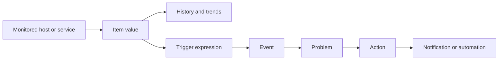
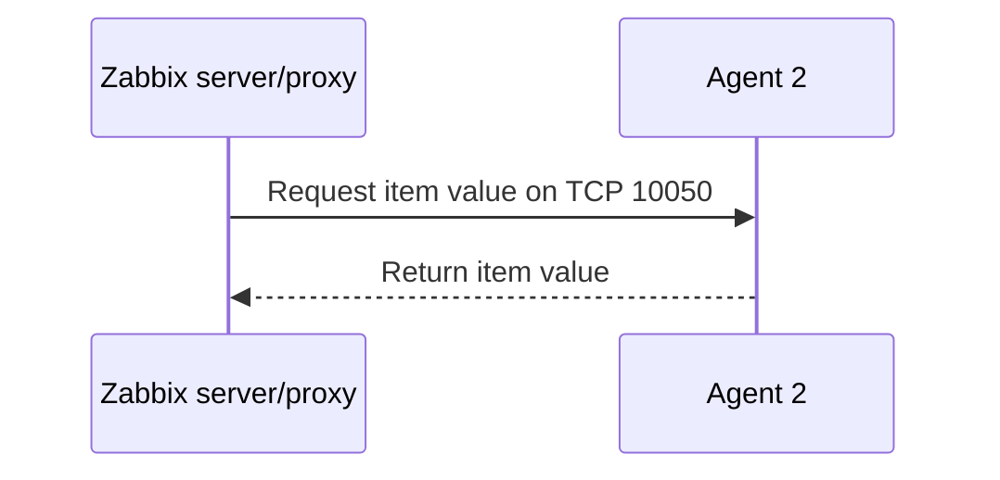
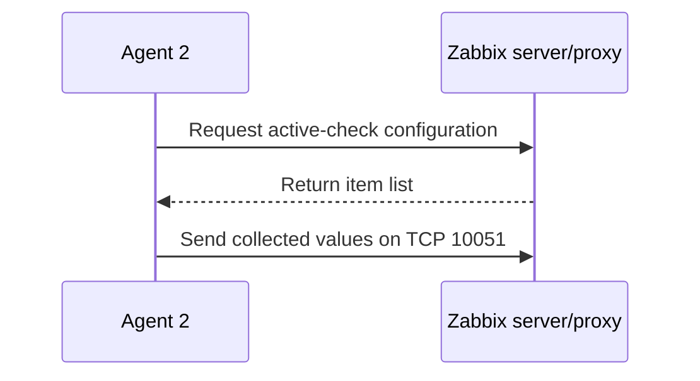

# Monitoring Fundamentals

## Core Zabbix Concepts

---

# What Monitoring Should Provide

A monitoring solution should provide:

- Visibility into system state
- Historical data for analysis
- Early warning of abnormal behavior
- Context for troubleshooting
- A controlled notification process
- Evidence for capacity and reliability decisions

Monitoring is most useful when it leads to a clear operational action.

---

# Core Data Flow



---

# Host

A **host** represents a monitored entity.

Examples:

- Linux server
- Windows server
- Network device
- Application endpoint
- Database
- Virtual machine
- Kubernetes cluster component

A host belongs to one or more host groups and can have templates attached.

---

# Item

An **item** defines one metric or value to collect.

Examples:

- CPU utilization
- Available memory
- Disk free space
- Service state
- HTTP response time
- Log entry count
- Certificate expiration date

An item includes a type, key, interval, data type, and retention behavior.

---

# Trigger

A **trigger** evaluates item data and detects an abnormal condition.

Example logic:

```text
Disk free space is below 10% for 10 minutes
```

A good trigger should:

- Reflect a meaningful operational risk
- Avoid unnecessary noise
- Include enough context
- Have an appropriate severity
- Recover automatically when the condition clears

---

# Event and Problem

An **event** records a state change.

A **problem** represents an active abnormal condition created by a trigger event.

Typical lifecycle:

```text
OK → Problem detected → Acknowledged → Recovery detected → Closed
```

Acknowledgement does not fix the condition. It records ownership or investigation status.

---

# Action and Media Type

An **action** defines what should happen after an event.

Examples:

- Send an email
- Send a chat message
- Call a webhook
- Run an approved remote command
- Escalate after a delay

A **media type** defines the notification channel and its configuration.

---

# Template

A **template** is a reusable monitoring definition.

A template can contain:

- Items
- Triggers
- Graphs
- Dashboards
- Discovery rules
- Host prototypes
- Macros
- Value maps

Templates make monitoring consistent and easier to maintain.

---

# Macros

Macros store reusable values.

Examples:

```text
{$CPU.UTIL.MAX}
{$DISK.FREE.MIN}
{$SERVICE.NAME}
{$KUBE.API.URL}
```

Use macros instead of hardcoding environment-specific values in templates.

---

# Passive Agent Check



The server or proxy initiates the connection.

---

# Active Agent Check



The agent initiates the connection.

---

# Active or Passive?

Passive checks can be useful when:

- The server can reach the host
- Direct polling is acceptable
- Firewall rules permit inbound agent access

Active checks can be useful when:

- Hosts are behind NAT or restrictive firewalls
- The agent should initiate communication
- Log monitoring requires active collection
- Large environments need reduced inbound connectivity

Many environments use both.

---

# Severity and Noise

Severity should communicate impact, not emotion.

A practical model:

- Information
- Warning
- Average
- High
- Disaster

Avoid alerting on every collected metric. Alert only when someone should investigate or act.

---

# Monitoring Design Questions

Before adding a metric, ask:

- What failure does this detect?
- Who owns the response?
- What threshold is meaningful?
- How quickly must it be detected?
- What context is needed?
- What is the expected recovery condition?
- Should it notify, create a ticket, or only appear on a dashboard?

---

# Key Takeaways

- Hosts represent monitored entities
- Items collect values
- Triggers evaluate conditions
- Events and problems record state changes
- Actions control notifications and automation
- Templates make monitoring reusable
- Macros keep configuration flexible
