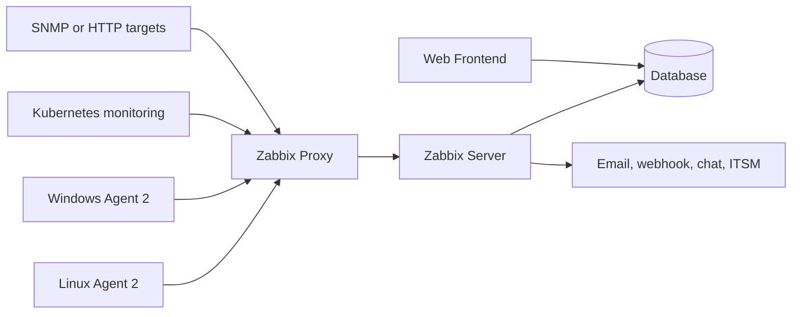

# Zabbix Architecture

## Server Components and Data Flow

---

# Main Components

A typical Zabbix deployment includes:

- Zabbix server
- Database backend
- Web frontend
- Zabbix agents
- Optional Zabbix proxies
- Optional Java gateway and web service
- Notification integrations

Each component has a separate responsibility.

---

# Reference Architecture



A proxy is optional but useful for remote sites, network segmentation, buffering, and scale.

---

# Zabbix Server

The server is the central processing component.

It:

- Receives and requests monitoring data
- Evaluates triggers
- Creates events and problems
- Executes actions
- Coordinates proxies
- Writes data to the database
- Processes discovery and autoregistration

The server is not the frontend and should not be treated as a database.

---

# Database Backend

The database stores:

- Configuration
- Users and permissions
- Historical item data
- Trends
- Events and problems
- Audit information
- Maintenance and action state

Database performance and retention policy are major factors in Zabbix scalability.

---

# Web Frontend

The frontend provides:

- Dashboards
- Host and template configuration
- Latest data
- Problems and event views
- User administration
- Reports
- Action and media-type configuration
- Audit and system-status views

The frontend communicates with the database and uses the server for runtime operations.

---

# Zabbix Proxy

A proxy can:

- Collect values on behalf of the server
- Buffer data during network interruption
- Reduce direct connectivity requirements
- Isolate remote or restricted networks
- Distribute data collection load

Proxy major-version compatibility must be checked against the selected server version.

---

# Agent and Agent 2

Agents collect operating-system and application metrics.

Agent 2:

- Supports Linux and Windows
- Uses a plugin-based design
- Supports active and passive checks
- Provides integrations for several applications
- Runs under a service manager on Linux
- Can run as a Windows service

Use the latest agent version supported by the selected server release.

---

# Common Network Ports

| Component | Default port | Direction |
|---|---:|---|
| Agent passive checks | TCP 10050 | Server/proxy to agent |
| Server or proxy trapper | TCP 10051 | Agent/proxy/sender to server or proxy |
| Web frontend | TCP 80/443 or deployment-specific | User to frontend |
| Database | Database-specific | Server/frontend/proxy to database |

Production firewall rules should be explicit and minimal.

---

# Installation Approaches

Common deployment approaches:

- Distribution packages
- Official Zabbix packages
- Containers
- Virtual appliance
- Cloud service
- Source build

For production, select an approach that supports:

- Repeatable upgrades
- Backup and restore
- Secret management
- Monitoring of the monitoring platform
- Log collection
- Capacity growth
- Security patching

---

# Generic Server Configuration

```ini
DBHost=db.example.local
DBName=zabbix
DBUser=zabbix
DBPassword=${SECRET_FROM_SECURE_STORE}

LogFile=/var/log/zabbix/zabbix_server.log
LogFileSize=0
Timeout=4
```

Do not store real production secrets in source control.

---

# Capacity Planning

Sizing depends on:

- Number of hosts
- Number of enabled items
- Collection intervals
- Trigger volume
- History and trend retention
- Preprocessing workload
- Discovery frequency
- Proxy topology
- Database engine and storage performance

The number of hosts alone is not enough for sizing.

---

# Data Retention

Long retention increases database size and maintenance work.

Review:

- Item history
- Trend retention
- Event retention
- Audit retention
- Housekeeping strategy
- Partitioning or time-series database options
- Backup retention

Keep detailed data only as long as it provides operational value.

---

# High Availability

Zabbix server high availability can reduce central-server downtime.

HA still requires:

- A reliable shared or highly available database
- Redundant frontend access
- Load-balancer or access strategy
- Tested failover
- Monitoring of HA nodes
- Backup and recovery procedures

HA does not replace backup.

---

# Production Readiness Checklist

- Supported Zabbix version selected
- Database compatibility verified
- TLS enabled
- Default credentials removed
- Backup and restore tested
- Retention policy defined
- Alert ownership documented
- Monitoring platform monitored
- Upgrade plan documented
- Capacity thresholds defined

---

# Key Takeaways

- The server processes monitoring logic
- The database stores configuration and data
- The frontend provides management and visualization
- Proxies support distribution and buffering
- Agents collect host-level metrics
- Scale depends mainly on item volume, intervals, retention, and database performance
