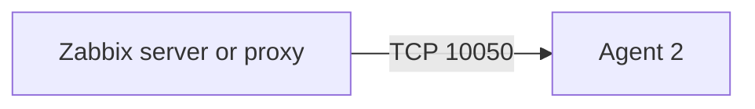

# Linux and Windows Monitoring

## Zabbix Agent 2

---

# Agent 2 Workflow

Agent 2 runs on the monitored host and exposes or sends metric values.

Typical metrics:

- CPU and load
- Memory
- Filesystems
- Network interfaces
- Processes and services
- Log files
- Operating-system information
- Application-specific plugin metrics

---

# Agent 2 or Classic Agent?

Use Agent 2 when it is supported and suitable because it offers:

- Plugin-based integrations
- Consistent Linux and Windows support
- Modern application monitoring capabilities
- Active and passive checks
- A single process model

Review the official comparison and platform requirements before standardizing.

---

# Linux Installation Approach

Use the official package instructions for the selected Zabbix and operating-system versions.

Typical service workflow:

```bash
sudo systemctl enable --now zabbix-agent2
sudo systemctl status zabbix-agent2
sudo systemctl restart zabbix-agent2
```

Typical configuration file:

```text
/etc/zabbix/zabbix_agent2.conf
```

---

# Generic Linux Configuration

```ini
Server=zabbix.example.com
ServerActive=zabbix.example.com
Hostname=linux01.example.com

ListenPort=10050
LogType=file
LogFile=/var/log/zabbix/zabbix_agent2.log

Include=/etc/zabbix/zabbix_agent2.d/*.conf
```

The configured hostname must match the host name expected by active checks.

---

# Windows Installation Approach

Recommended options:

- Official MSI package
- Official precompiled archive where appropriate
- Automated software deployment

After installation:

- Configure the server or proxy address
- Configure a unique host name
- Start the service
- Set automatic startup
- Validate Windows Firewall rules
- Link the correct Windows template

---

# Generic Windows Configuration

```ini
Server=zabbix.example.com
ServerActive=zabbix.example.com
Hostname=win01.example.com

ListenPort=10050
LogType=file
LogFile=C:\Program Files\Zabbix Agent 2\zabbix_agent2.log
```

Use paths that match the actual installation method.

---

# Add the Host in Zabbix

Typical frontend workflow:

1. Open **Data collection → Hosts**
2. Select **Create host**
3. Enter the technical host name
4. Add the host to a host group
5. Configure an agent interface for passive checks
6. Link a template
7. Configure required macros
8. Enable the host
9. Review availability and latest data

---

# Common Templates

Examples:

- Linux by Zabbix agent
- Linux by Zabbix agent active
- Windows by Zabbix agent
- Windows by Zabbix agent active
- Application-specific Agent 2 templates

Template names can vary by Zabbix version. Verify the selected release.

---

# Passive Check Connectivity



Validate:

- DNS resolution
- Routing
- Firewall
- `Server=` allowlist
- Listening address and port
- Correct host interface
- Agent service status

---

# Active Check Connectivity


Validate:

- `ServerActive=`
- Hostname match
- Outbound firewall access
- Active template or active items
- Server or proxy trapper availability

---

# Local Testing

Test a supported item directly:

```bash
zabbix_agent2 -t system.uptime
zabbix_agent2 -t system.hostname
```

Test a passive check from an authorized system:

```bash
zabbix_get \
  -s linux01.example.com \
  -p 10050 \
  -k system.uptime
```

Do not expose agent access broadly just to make a test work.

---

# Encryption

Supported secure approaches include:

- TLS with pre-shared keys
- TLS with certificates

Security requirements:

- Store PSKs and private keys securely
- Restrict file permissions
- Verify certificate issuer and subject where appropriate
- Rotate credentials
- Do not reuse one PSK across unrelated environments
- Configure both agent and host encryption settings consistently

---

# Common Agent Problems

| Symptom | Likely checks |
|---|---|
| Agent unavailable | Service, port, firewall, address, `Server=` |
| No active checks | `ServerActive=`, hostname, host enabled |
| Unsupported item | Item key, permissions, plugin, dependency |
| Access denied | Allowlist, TLS mode, PSK identity, certificate |
| Wrong host receives data | Duplicate or mismatched hostname |
| Log item does not update | Active checks, file path, permissions, rotation |

---

# Operational Best Practices

- Use templates instead of per-host custom items
- Use macros for thresholds
- Standardize host naming
- Automate installation and configuration
- Prefer secure communication
- Monitor agent versions and availability
- Document ownership for custom user parameters
- Avoid running the agent as root unless strictly required and reviewed

---

# Key Takeaways

- Agent 2 supports active and passive collection
- Hostname consistency is critical
- Templates provide most standard monitoring
- Connectivity and encryption must match on both sides
- Local item testing reduces troubleshooting time
