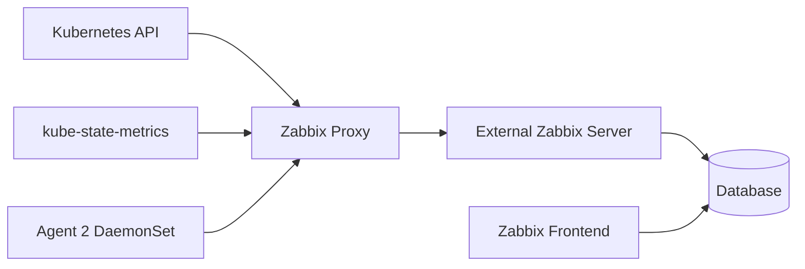

# Kubernetes Monitoring

## Architecture, Templates, and Helm Workflow

---

# Monitoring Goals

Kubernetes monitoring should provide visibility into:

- Cluster nodes
- Control-plane components
- Workloads and object state
- Pods, deployments, daemon sets, and stateful sets
- Resource requests and limits
- Restarts and scheduling problems
- API availability
- Node operating-system metrics

A cluster view and a node view are both required.

---

# Reference Architecture



The official Helm chart deploys monitoring components into the cluster.

---

# Main Components

Typical components include:

- Zabbix proxy
- Zabbix Agent 2 as a DaemonSet
- kube-state-metrics
- Kubernetes service account and RBAC
- Configuration for communication with the external Zabbix server
- Templates for nodes and cluster state

Exact resources depend on the chart version and values.

---

# Why Use a Proxy?

The in-cluster proxy can:

- Collect cluster data near the source
- Buffer values during external connectivity interruption
- Reduce direct access from the central server
- Centralize cluster-side collection
- Send data through one controlled path

Use TLS between proxy and server.

---

# Prerequisites

- Supported Zabbix server version
- Matching or compatible proxy/chart version
- Kubernetes cluster access
- `kubectl`
- Helm
- Namespace creation permission
- Service-account and RBAC permission
- Network access from the cluster to the Zabbix server
- Capacity for the deployed monitoring components

---

# Helm Workflow

Use the official chart instructions for the selected release.

Generic workflow:

```bash
helm repo add zabbix-chart-<version> \
  https://cdn.zabbix.com/zabbix/integrations/kubernetes-helm/<version>

helm repo update

helm show values \
  zabbix-chart-<version>/zabbix-helm-chart \
  > zabbix-values.yaml
```

Confirm the repository and chart names in the official release documentation.

---

# Configure Values

Typical values to review:

```yaml
zabbixProxy:
  env:
    - name: ZBX_SERVER_HOST
      value: "zabbix.example.com"
    - name: ZBX_SERVER_PORT
      value: "10051"

zabbixAgent:
  enabled: true

kubeStateMetrics:
  enabled: true
```

The example is illustrative. Actual chart keys may change.

---

# Deploy into a Namespace

Generic flow:

```bash
kubectl create namespace monitoring

helm upgrade --install zabbix \
  zabbix-chart-<version>/zabbix-helm-chart \
  --namespace monitoring \
  --values zabbix-values.yaml
```

Before applying, review the rendered manifests:

```bash
helm template zabbix \
  zabbix-chart-<version>/zabbix-helm-chart \
  --namespace monitoring \
  --values zabbix-values.yaml
```

---

# Zabbix Frontend Configuration

Typical steps:

1. Register the deployed proxy
2. Import or verify the Kubernetes templates
3. Create a host for Kubernetes nodes
4. Link **Kubernetes nodes by HTTP**
5. Create a host for cluster state
6. Link **Kubernetes cluster state by HTTP**
7. Configure required macros
8. Select the proxy
9. Verify discovery and latest data

Template requirements can differ by version.

---

# Tokens and Macros

Kubernetes templates may require:

- API URL
- Service-account token
- Proxy selection
- Cluster name
- Component endpoints
- Discovery filters

Retrieve tokens and resource names using the instructions for the installed chart version.

Never commit a real service-account token to the repository.

---

# Use Filtering Macros

Large clusters can generate many discovered objects.

Use filtering macros to:

- Exclude irrelevant namespaces
- Exclude short-lived workloads where appropriate
- Limit discovery scope
- Reduce database growth
- Reduce unsupported items
- Keep dashboards actionable

Start narrow and expand deliberately.

---

# Existing Agent Conflict

A node may already run a host-installed Zabbix agent.

The Helm chart may deploy Agent 2 as a DaemonSet using the same default agent port.

Before deployment:

- Check for existing host agents
- Check port usage
- Decide which agent should provide node metrics
- Avoid duplicate host creation
- Avoid two agents binding the same port
- Document the selected architecture

Do not disable an existing production agent without a migration plan.

---

# Kubernetes RBAC

Apply least privilege:

- Use a dedicated service account
- Grant only required read access
- Review cluster-wide permissions
- Avoid unnecessary secret access
- Rotate credentials
- Audit chart updates for RBAC changes
- Use separate credentials per cluster

---

# Troubleshooting Commands

```bash
kubectl get pods -n monitoring
kubectl get deployments,daemonsets -n monitoring
kubectl describe pod <pod-name> -n monitoring
kubectl logs <pod-name> -n monitoring
kubectl get events -n monitoring --sort-by=.lastTimestamp
helm status zabbix -n monitoring
helm get values zabbix -n monitoring
```

Also review proxy availability and logs in Zabbix.

---

# Common Kubernetes Problems

| Symptom | Checks |
|---|---|
| Proxy unavailable | DNS, outbound TCP 10051, TLS, proxy name |
| No nodes discovered | Token, API URL, macros, permissions |
| Forbidden API response | Service-account RBAC |
| DaemonSet not ready | Scheduling, image pull, host port conflict |
| Too many discovered objects | Filtering macros |
| Unsupported HTTP items | Endpoint, token, certificate trust |
| Duplicate hosts | Existing monitoring and discovery prototypes |

---

# Key Takeaways

- Kubernetes monitoring combines API, object-state, and node metrics
- The official chart deploys the cluster-side components
- Version compatibility matters
- Templates and macros complete the Zabbix-side setup
- Filtering and RBAC are essential for production use
