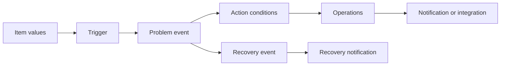

# Alerting, Troubleshooting, and Maintenance

---

# Alerting Workflow



A complete alert design includes both problem and recovery behavior.

---

# Media Types

Common media types:

- Email
- Webhook
- Chat integration
- ITSM integration
- SMS gateway
- Custom script

Validate:

- Credentials
- Network access
- TLS trust
- Sender identity
- Rate limits
- Message templates
- Failure handling

---

# Trigger Actions

An action can filter by:

- Trigger severity
- Host group
- Host
- Tag
- Time period
- Maintenance state
- Event name
- Suppression state

Use tags and host groups to route alerts to the correct owner.

---

# Escalation Design

Example:

```text
0 minutes   Notify on-call team
15 minutes  Notify service owner if unacknowledged
30 minutes  Escalate to incident manager
Recovery    Notify all involved recipients
```

Escalation should match the operational response model.

---

# Avoid Alert Noise

Reduce noise by:

- Using meaningful thresholds
- Requiring a sustained condition
- Applying dependencies
- Using maintenance windows
- Filtering discovery
- Suppressing symptom problems
- Routing by ownership
- Reviewing repetitive alerts
- Removing alerts with no response action

An ignored alert is not useful monitoring.

---

# Main Log Locations

Typical package-based Linux paths:

```text
/var/log/zabbix/zabbix_server.log
/var/log/zabbix/zabbix_proxy.log
/var/log/zabbix/zabbix_agent2.log
```

Systemd commands:

```bash
systemctl status zabbix-server
journalctl -u zabbix-server -xe
journalctl -u zabbix-agent2 -xe
```

Actual paths depend on package, container, and configuration.

---

# Container Logs

```bash
docker compose \
  --env-file examples/.env \
  -f examples/docker-compose.yml \
  ps

docker compose \
  --env-file examples/.env \
  -f examples/docker-compose.yml \
  logs --tail=200 zabbix-server

docker compose \
  --env-file examples/.env \
  -f examples/docker-compose.yml \
  logs --tail=200 zabbix-web
```

Start with the component that owns the failing step.

---

# Troubleshooting Method

1. Define the symptom
2. Identify the data path
3. Check service state
4. Check network connectivity
5. Check authentication or TLS
6. Check configuration names and identities
7. Check logs
8. Check queue and unsupported items
9. Test one item manually
10. Change one variable at a time
11. Confirm recovery
12. Document the root cause

---

# Agent Troubleshooting

Check:

```bash
systemctl status zabbix-agent2
ss -lntp | grep 10050
zabbix_agent2 -t system.uptime
journalctl -u zabbix-agent2 -xe
```

Then verify:

- `Server=`
- `ServerActive=`
- `Hostname=`
- Host enabled state
- Template item type
- TLS mode
- Firewall
- DNS

---

# Server Troubleshooting

Check:

```bash
systemctl status zabbix-server
journalctl -u zabbix-server -xe
ss -lntp | grep 10051
```

Review:

- Database connectivity
- Configuration cache
- Poller utilization
- Preprocessing
- Housekeeper activity
- Proxy availability
- Unsupported items
- Queue delay
- Free disk space

---

# Queue

The queue shows checks that are delayed.

Possible causes:

- Unreachable agents
- Slow checks
- Insufficient pollers
- Network latency
- Proxy interruption
- Overloaded server
- Database latency
- Too-frequent intervals

Do not increase process counts before identifying the bottleneck.

---

# Unsupported Items

An item can become unsupported because of:

- Invalid key
- Missing Agent 2 plugin
- Permission denied
- Invalid preprocessing
- Authentication failure
- Endpoint unavailable
- TLS failure
- Bad macro value
- Timeout
- Template and component version mismatch

Read the item error text before changing configuration.

---

# Maintenance Windows

Maintenance can:

- Suppress problem notifications
- Mark data collection behavior
- Prevent planned work from creating noise

Good maintenance practice:

- Scope only affected hosts
- Use correct start and end time
- Document owner and reason
- Avoid excessively long windows
- Verify automatic expiration
- Review open problems after maintenance

---

# Housekeeping and Retention

Review regularly:

- History retention
- Trend retention
- Event retention
- Audit retention
- Database growth
- Housekeeper load
- Partitioning strategy
- Backup size and duration
- Restore time

Retention should align with troubleshooting, reporting, and compliance needs.

---

# Backup Scope

A recoverable Zabbix backup normally includes:

- Database
- Server configuration
- Proxy configuration where required
- Frontend configuration
- TLS material
- Custom scripts
- External modules
- Alerting integrations
- Documentation of versions and topology

Test restoration, not only backup creation.

---

# Monitoring the Monitoring Platform

Monitor:

- Zabbix server availability
- Database availability and latency
- Proxy availability
- Queue delay
- Internal process utilization
- Disk usage
- Database growth
- Notification failures
- Certificate expiration
- Backup success
- Time synchronization

A silent monitoring outage is a major operational risk.

---

# Key Takeaways

- Alerting must route actionable problems
- Logs should be checked along the failing data path
- Queue and unsupported items provide important clues
- Maintenance prevents planned-work noise
- Retention and database health require continuous review
- Backup and monitoring of Zabbix itself are mandatory production practices
